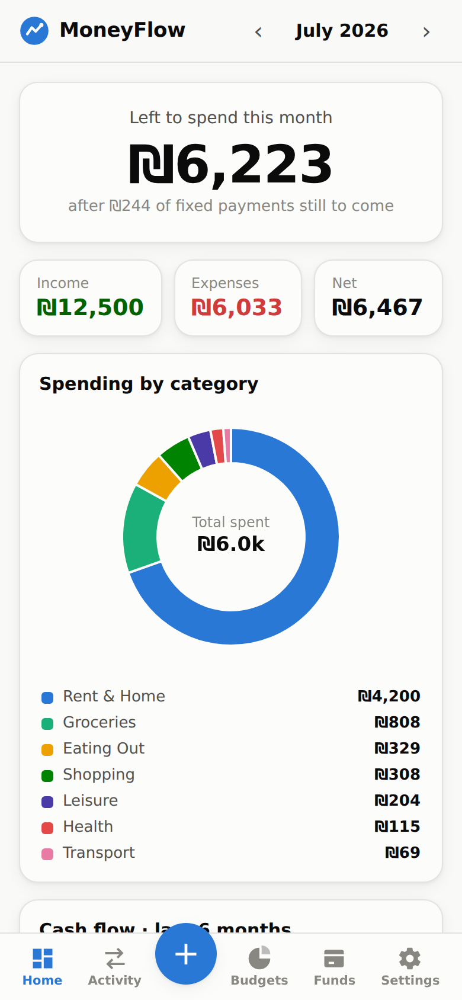
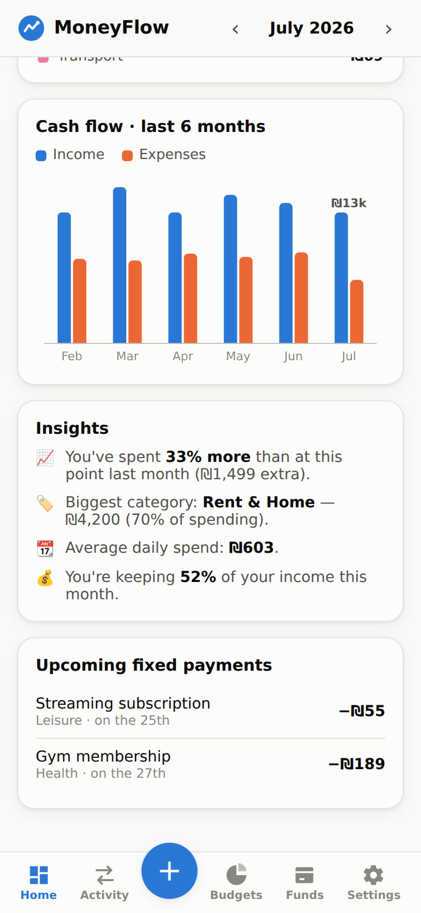
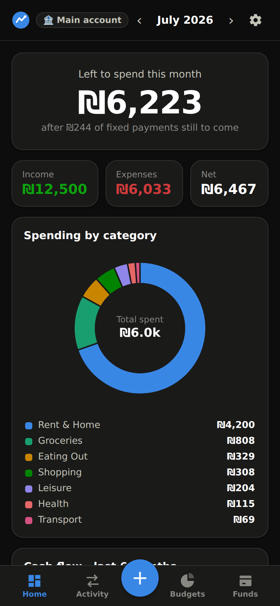
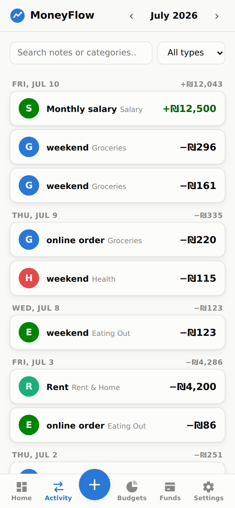
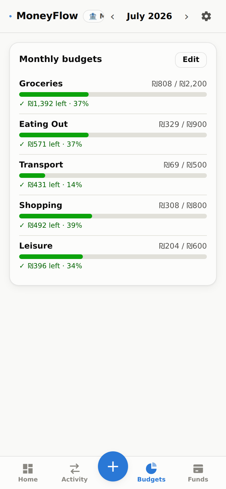
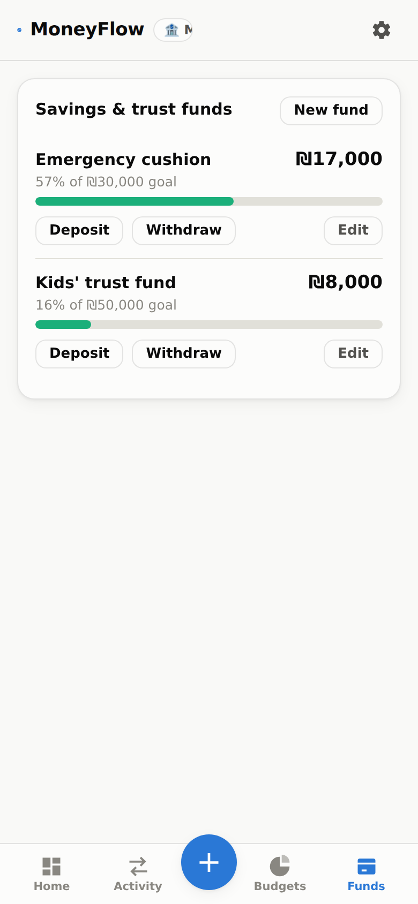

# 💸 MoneyFlow — Personal Money Manager

A private, **do-it-yourself** money manager, inspired by apps like [RiseUp](https://www.riseup.co.il/).
Track your income, expenses, taxes, budgets and savings/trust funds — and always know **how much you have left to spend this month**.

**🔒 100% yours.** MoneyFlow never connects to a bank account or a credit/debit card. Every shekel/dollar is entered by hand, and all of your data lives **only on your device** (browser storage). Nothing is ever uploaded anywhere.

**📱 Works everywhere.** It's a Progressive Web App: open it from any phone or computer, install it to your home screen, and it even works offline — so you can log that lunch while you're still at the restaurant.

<p align="center">
  
  
  
</p>

---

## ✨ Features

### 🏠 Dashboard
- **“Left to spend this month”** — your income, minus what you've spent, minus the fixed payments still coming up. One number, RiseUp-style.
- Income / Expenses / Net tiles for the month.
- **Spending by category** donut chart.
- **Cash flow** — income vs. expenses for the last 6 months.
- **Insights** — are you spending more or less than last month? What's your biggest category? Your average daily spend? How much of your income are you keeping? How much tax did you pay?
- **Upcoming fixed payments** — see what's still going to leave your account this month.

### 🔄 Activity
- Add income & expenses in two taps with the big **+** button.
- Categories, dates, notes, search and filtering.
- Grouped by day with daily totals.
- Mark any transaction as **“repeats monthly”** — rent, salary, subscriptions — and it will be added automatically on its day every month.

### 🎯 Budgets
- Set a monthly limit per category.
- Color-coded progress: ✓ on track, ⚠ getting close, ✕ over budget — with exactly how much you have left.

### 🏦 Savings & trust funds
- Create funds — an emergency cushion, a trip, a trust fund for the kids.
- Deposit / withdraw with full history, and track progress toward a goal.

### ⚙️ More
- 🏦 **Bank identifier** — give your account a short label (e.g. "Main account") shown in the top bar, so you always know which money you're looking at. Just a label — never real bank details.
- 🌍 Currency of your choice (₪ / $ / € / £).
- 🌗 Automatic light & dark mode.
- 🏷️ Fully customizable categories (including a built-in **Taxes** category).
- 💾 **Export / import backups** as JSON — move between devices, or just sleep well.
- 🧪 One-tap **demo data** so you can explore before committing.

<p align="center">
  
  
  
</p>

---

## 🚀 Getting started

### Use it online (recommended)

The app is a static site, deployed automatically to **GitHub Pages** — free, always on, reachable from anywhere:

**➡️ https://guy448844-lab.github.io/Bank-Management/**

One-time setup (repo owner only):
1. Go to the repository **Settings → Pages**.
2. Under **Build and deployment → Source**, choose **GitHub Actions**.
3. Push to `main` (or run the *Deploy to GitHub Pages* workflow manually). Done — every future push redeploys automatically.

> Tip: on your phone, open the site and choose **“Add to Home Screen”** — it installs like a native app and works offline.

### Run it locally

No build step, no dependencies:

```bash
git clone https://github.com/guy448844-lab/Bank-Management.git
cd Bank-Management
python3 -m http.server 8000
# open http://localhost:8000
```

(Or just open `index.html` directly in a browser.)

---

## 🔐 Privacy & your data

- **No servers, no accounts, no tracking.** The app is plain HTML/CSS/JS served as static files.
- All data is stored in your browser's `localStorage`, on your device only.
- Because storage is per-device/per-browser, use **Settings → Export backup** to save a JSON file, and **Import backup** to load it on another device.
- **Erase everything** in Settings wipes the data instantly.

## 🧰 Tech

| | |
|---|---|
| Frontend | Vanilla HTML / CSS / JavaScript — zero frameworks, zero dependencies |
| Charts | Hand-rolled `<canvas>` (donut + grouped bars) with hover tooltips, light/dark aware, colorblind-safe palette |
| Storage | `localStorage` (with JSON export/import) |
| Offline / install | PWA — web manifest + service worker (cache-first) |
| Hosting | GitHub Pages via GitHub Actions (`.github/workflows/deploy.yml`) |

### Project layout

```
├── index.html               # the whole UI
├── css/style.css            # styles + light/dark design tokens
├── js/
│   ├── store.js             # data model, persistence, recurring engine, demo data
│   ├── charts.js            # canvas donut & cash-flow bar charts
│   └── app.js               # views, modals, insights, settings
├── sw.js                    # service worker (offline support)
├── manifest.webmanifest     # PWA manifest
├── icons/                   # app icons
└── .github/workflows/       # GitHub Pages deployment
```

## 🗺️ Ideas for later

- Yearly view & tax-year summary
- CSV export for spreadsheets
- Multiple profiles (e.g. personal + business)
- Optional PIN lock

## 📄 License

[MIT](LICENSE) — do whatever you like with it.
