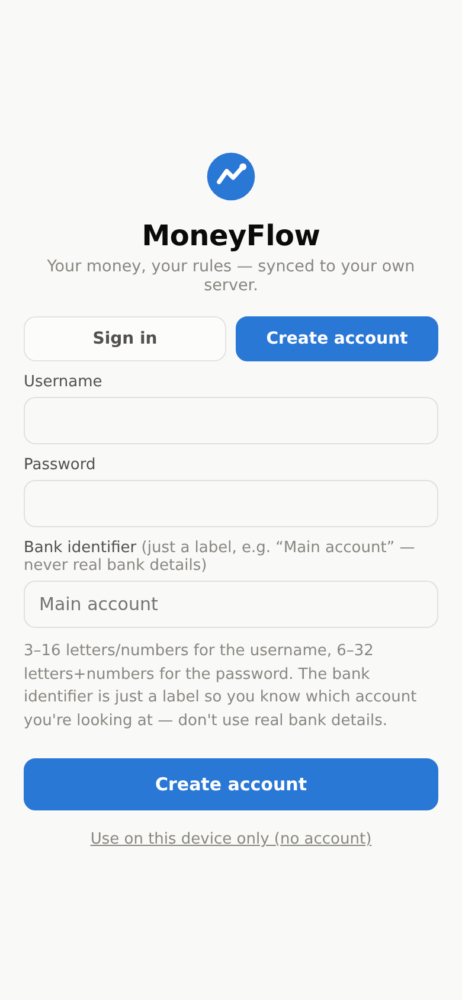

# 💸 MoneyFlow — Personal Money Manager

A private, **do-it-yourself** money manager, inspired by apps like [RiseUp](https://www.riseup.co.il/).
Track your income, expenses, taxes, budgets and savings/trust funds — and always know **how much you have left to spend this month**.

**🔒 100% yours.** MoneyFlow never connects to a bank account or a credit/debit card. Every shekel/dollar is entered by hand, and your data lives **only on your device** — or, if you run the included sync server, **encrypted on your own computer**. No third party ever sees it.

**📱 Works everywhere.** It's a Progressive Web App: open it from any phone or computer, install it to your home screen, and it even works offline — so you can log that lunch while you're still at the restaurant.

<p align="center">
  
  
  
</p>

---

## ✨ Features

### 🏠 Dashboard
- **“Left to spend this month”** — your income, minus what you've spent, minus the fixed payments still coming up. One number, RiseUp-style.
- Income / Expenses / Net tiles for the month.
- **Spending by category** donut chart.
- **Cash flow** — income vs. expenses for the last 6 months.
- **Insights** — are you spending more or less than last month? What's your biggest category? Your average daily spend? How much of your income are you keeping? How much tax did you pay?
- **Upcoming fixed payments** — see what's still going to leave your account this month.

### 🔄 Activity
- Add income & expenses in two taps with the big **+** button.
- Categories, dates, notes, search and filtering.
- Grouped by day with daily totals.
- Mark any transaction as **“repeats monthly”** — rent, salary, subscriptions — and it will be added automatically on its day every month.

### 🎯 Budgets
- Set a monthly limit per category.
- Color-coded progress: ✓ on track, ⚠ getting close, ✕ over budget — with exactly how much you have left.

### 🏦 Savings & trust funds
- Create funds — an emergency cushion, a trip, a trust fund for the kids.
- Deposit / withdraw with full history, and track progress toward a goal.

### 👤 Accounts & sync (optional)
- Run the included **sync server** (one file, zero dependencies) and the app gains a **login screen**: username + password + a *bank identifier* — a label like "Main account" shown in the top bar so you always know which account you're looking at. **Never real bank details.**
- Each user gets their own storage, **encrypted at rest** (AES-256-GCM); passwords are salted & hashed (scrypt), sessions live in an HttpOnly cookie.
- Changes save automatically and **follow you across devices** — no more exporting/importing JSON.
- Username rules: 3–16 letters/numbers. Password rules: 6–32 letters+numbers (at least one of each). No special characters.
- Without the server (e.g. on GitHub Pages) the app quietly runs in **device-only mode**, exactly as before.

### ⚙️ More
- 🌍 Currency of your choice (₪ / $ / € / £).
- 🌗 Automatic light & dark mode.
- 🏷️ Fully customizable categories (including a built-in **Taxes** category).
- 💾 **Export / import backups** as JSON — move between devices, or just sleep well.
- 🧪 One-tap **demo data** so you can explore before committing.

<p align="center">
  
  
  
</p>

---

## 🚀 Getting started

### Use it online (recommended)

The app is a static site, deployed automatically to **GitHub Pages** — free, always on, reachable from anywhere:

**➡️ https://guy448844-lab.github.io/Bank-Management/**

One-time setup (repo owner only):
1. Go to the repository **Settings → Pages**.
2. Under **Build and deployment → Source**, choose **GitHub Actions**.
3. Push to `main` (or run the *Deploy to GitHub Pages* workflow manually). Done — every future push redeploys automatically.

> Tip: on your phone, open the site and choose **“Add to Home Screen”** — it installs like a native app and works offline.

> Note: the GitHub Pages copy runs in **device-only mode** (no accounts) because Pages can't run a server. For accounts + sync, run the sync server below.

### Run it with accounts & sync (recommended for family use)

The sync server is a single file with **zero dependencies** — you only need [Node.js](https://nodejs.org):

```bash
git clone https://github.com/guy448844-lab/Bank-Management.git
cd Bank-Management
node server/server.js
# open http://localhost:8080 → the login screen appears
```

That's the whole database: user accounts and each user's **encrypted** data are stored as files under `server/data/` (gitignored — never committed). Back up that folder and you've backed up everyone's data.

**Reaching it from outside your home (the restaurant test):** the easiest way is a free [Cloudflare Tunnel](https://developers.cloudflare.com/cloudflare-tunnel/) — it gives your home computer a public HTTPS address with no router configuration:

```bash
# in a second terminal, after installing cloudflared:
cloudflared tunnel --url http://localhost:8080
```

It prints a `https://….trycloudflare.com` address — open that on any phone, sign in, done. Alternatives: port-forwarding on your router, a VPN like Tailscale, or any small Node host (note that free tiers of platforms like Render wipe local files on redeploy, so prefer a machine whose disk persists).

### Run it locally (device-only, no accounts)

```bash
python3 -m http.server 8000   # from the repo folder
# open http://localhost:8000
```

---

## 🔐 Privacy & security

- **No third parties, no tracking.** Your data is either in your browser (device-only mode) or on **your own server** — nowhere else.
- Passwords are **salted and hashed with scrypt** — the server never stores or sees them in plain text.
- Each user's data is **encrypted at rest with AES-256-GCM**, keyed from a secret generated on the server's first run (`server/data/secret.key` — back it up; without it the data can't be decrypted).
- Sessions are random tokens in an **HttpOnly cookie** (30 days); repeated failed logins are throttled.
- The username, password and bank identifier are **app-only credentials** — never use your real online-banking details.
- This is friends-and-family-grade security, not a bank vault: if you expose the server to the internet, put it behind HTTPS (Cloudflare Tunnel gives you that for free).
- In device-only mode, **Settings → Export backup** saves a JSON file you can import elsewhere; **Erase everything** wipes instantly.

## 🧰 Tech

| | |
|---|---|
| Frontend | Vanilla HTML / CSS / JavaScript — zero frameworks, zero dependencies |
| Charts | Hand-rolled `<canvas>` (donut + grouped bars) with hover tooltips, light/dark aware, colorblind-safe palette |
| Storage | `localStorage` locally + optional per-user AES-256-GCM-encrypted storage on the sync server |
| Accounts | Single-file Node.js server (no npm packages): scrypt password hashes, cookie sessions |
| Offline / install | PWA — web manifest + service worker (cache-first, API never cached) |
| Hosting | GitHub Pages via GitHub Actions (device-only mode) or your own machine (full mode) |

### Project layout

```
├── index.html               # the whole UI
├── css/style.css            # styles + light/dark design tokens
├── js/
│   ├── store.js             # data model, persistence, recurring engine, demo data
│   ├── charts.js            # canvas donut & cash-flow bar charts
│   ├── auth.js              # login/register screen + cross-device sync
│   └── app.js               # views, modals, insights, settings
├── server/
│   └── server.js            # zero-dependency sync server (accounts + encrypted storage)
├── sw.js                    # service worker (offline support)
├── manifest.webmanifest     # PWA manifest
├── icons/                   # app icons
└── .github/workflows/       # GitHub Pages deployment
```

## 🗺️ Ideas for later

- Yearly view & tax-year summary
- CSV export for spreadsheets
- Multiple profiles (e.g. personal + business)
- Optional PIN lock

## 📄 License

[MIT](LICENSE) — do whatever you like with it.
